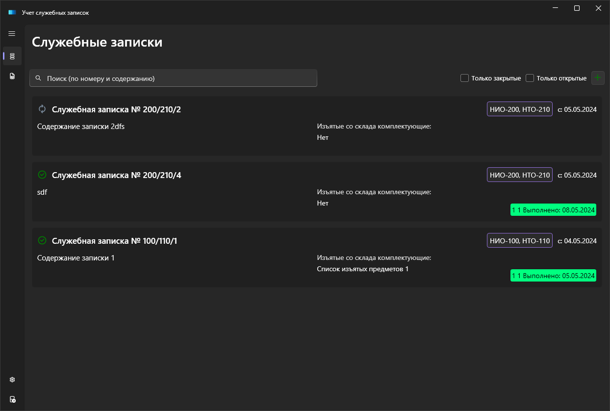

# MemoAccount

  

Приложение для учета служебных записок в организации.

### Описание

Приложение позволяет учесть служебные записи, указать ответственных за их исполнение,
создавать отчеты по ним.

### Возможности

- регистрация и авторизация пользователей
- создание, редактирование и просмотр служебных записок
- просмотр отчетов по служебным запискам
- возможность фильтровать списки служебных записок по номеру, статусу, ответственному и дате создания

### Скриншоты

Скриншоты и пример отчета можно найти в папке [presentation-images](presentation-images)

### Технологии

- .NET Core 3.1
- Entity Framework Core
- WPF
- MVVM

### Лицензия

Проект распространяется по лицензии MIT. Подробнее см. файл [LICENSE](https://github.com/DmitryYanutsev/MemoAccount/blob/master/LICENSE).

